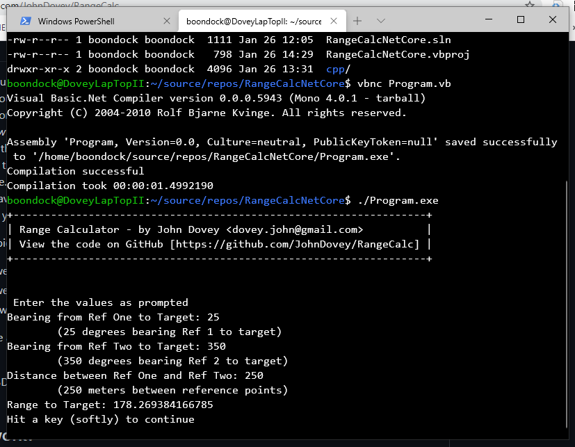

# RangeCalc
An attempt to recreate my Range Calculator as a .Net Core app

## Origin
Imagine, for no particular reason, that you are standing guard in tower 52 on the perimeter of Balad Joint Base in Iraq. Looking out over the wire, you see a **technical** (Toyota Pickup with a heavy weapon mounted on the back). There are some guys fiddling with the weapon and you want to report it to the BDOC on the Base Defence net.

You *know* that the first question they are going to ask you is how far outside the wire it is, so you want to estimate the distance (range) to the vehicle.
Instead of guessing, you take a compass bearing from your position to the vehicle. Then you climb on the radio and call your buddy at Tower 53. You ask him if he's seen the vehicle. He has. Now you ask him for a compass bearing from his position to the vehicle.

You know (because you have paced it out numerous times to go and borrow some coffee or just have a chat) that the distance between your two towers (52 and 53) is as close as dammit to 250 meters.

Now you have three pieces of data.
  1. Bearing from Tower 52 to target (say **25** degrees)
  2. Bearing from Tower 53 to the target (say **350** degrees)
  3. Distance from Tower 52 to Tower 53 (**250m**)
  
Now you run this little app, and plug those three pieces of data in. Out pops the range to the target : **178.269384166785**

You can now call up BDOC and with absolute assurance tell them that there is a Technical **178 meters** from the wire. 

## How does it work?
It's the simplest [Trigonometry](https://en.wikipedia.org/wiki/Trigonometry) which you probably learnt (and promptly forgot) as a kid. You have the length of one side of a triangle and the angles for the other two sides. The simple formula in this program simply calculates the apex of the triangle's distance from the middle of the base of the triangle. 
You don't have to worry about that. It just works.

## The program
The first version of this I wrote in C++ because that's what I had, a little cpp app on my phone. That original program is included here in the cpp folder. 
I converted it to VB.Net as a Net Core console app, hoping it would be platform neutral, but ran into way too many complications. Once I'd gone down the whole rabbit-hole and created the app in windows, I discovered I could simply compile the .vb file on Ubuntu with Mono (Running Ubuntu 20.04 on WSL under windows).
That compiled exe is also included here. 

## Quo Vadis
It would be nice to create a native app with some more features. I've written this same functionality in Xcode on the Mac as an app, and it works, but it's also way too much trouble. 
If someone wanted to tackle it, then some features I'd like to see would be
- Buttons and sliders and all those fancy things
- Log the two positions as GPS coords and calculate the range to a third 
- select positions from the map instead of having to add them manually.
- Draw the triangle (on the map) using the coords

## Comments/forks/commits
All are welcome. 

## Notes
.Net core/.Net 5.0 are odd. It tells you it's building a DLL. I was frustrated at first until I discovered
- It's not. It's creating both a dll and an exe
- You can run the dll using `dotnet RangeCalcNetCore.dll` from the command line in the windows shell, just the same as you would use `RangeCalcNetCore.exe`
- You can run `Program.exe` (The Mono version) from the command line in the windows shell, which makes it a lot more platform neutral than I thought
- It's not as friendly the other way around. Running the windows exe under linux doesn't seem to work. Your Mileage May Vary.

### Name Change
- Changed the name from ***RangeCalcNetCore*** to ***RangeCalc***

## Versions
- VB.Net
  - This is the main project
- C++
  - This is in the `cpp` [folder](cpp/)
 - VB Mono
   - In the main directory, compiled version of Program.vb as [Program.exe](Program.exe)
 - HTML 
   - `HTMLVersion` [folder](HTMLVer/)
 - GO Version
   - Added [Go version](RangeCalc.go) in `./RangeCalc.go/`
 - MAC Version
   - Added .NET 5.0 [VS Studio Solution/Project](https://github.com/JohnDovey/RangeCalc/tree/master/RangeCalcMac)
   - C# verion as a Console App
 

# Releases
Added a bunch of releases with the various binaries after GitHub kept whining about it.

- [HTML5](https://github.com/JohnDovey/RangeCalc/releases/tag/html-v0.2) Anything with a browser
- [GO](https://github.com/JohnDovey/RangeCalc/releases/tag/Go-v0.2) Windows & Linux
- [Mono](https://github.com/JohnDovey/RangeCalc/releases/tag/Mono-v02) Linux
- [.Net 5.0 Win](https://github.com/JohnDovey/RangeCalc/releases/tag/Net5.0-v0.2) Windows
- [.Net 5.0 MAC](https://github.com/JohnDovey/RangeCalc/releases/tag/MAC-Net5.0-v0.2) Mac

Hope that covers it :-)

If you have any more you'd like to see, add an Issue ...

