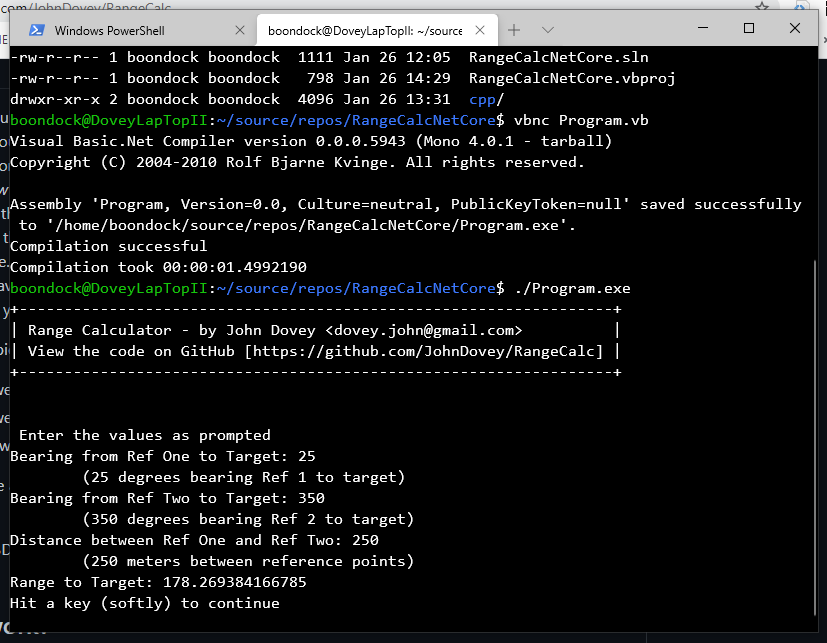

# RangeCalc
A range-to-target calculator from two compass bearings and a baseline distance — what started as an attempt to recreate my Range Calculator as a .NET Core app now has more versions than any one calculator reasonably needs: VB.NET, C++, Go (CLI + terminal UI), HTML5, macOS, and Android.

## Origin
Imagine, for no particular reason, that you are standing guard in tower 52 on the perimeter of Balad Joint Base in Iraq. Looking out over the wire, you see a **technical** (Toyota Pickup with a heavy weapon mounted on the back). There are some guys fiddling with the weapon and you want to report it to the BDOC on the Base Defence net.

You *know* that the first question they are going to ask you is how far outside the wire it is, so you want to estimate the distance (range) to the vehicle.
Instead of guessing, you take a compass bearing from your position to the vehicle. Then you climb on the radio and call your buddy at Tower 53. You ask him if he's seen the vehicle. He has. Now you ask him for a compass bearing from his position to the vehicle.

You know (because you have paced it out numerous times to go and borrow some coffee or just have a chat) that the distance between your two towers (52 and 53) is as close as dammit to 250 meters.

Now you have three pieces of data.
  1. Bearing from Tower 52 to target (say **25** degrees)
  2. Bearing from Tower 53 to the target (say **350** degrees)
  3. Distance from Tower 52 to Tower 53 (**250m**)

Now you run this little app, and plug those three pieces of data in. Out pops the range to the target : **357.0370016855286**

You can now call up BDOC and with absolute assurance tell them that there is a Technical **357 meters** from the wire.

## How does it work?
It's the simplest [Trigonometry](https://en.wikipedia.org/wiki/Trigonometry) which you probably learnt (and promptly forgot) as a kid. You have the length of one side of a triangle and the angles for the other two sides. The simple formula in this program calculates the apex of the triangle's distance from the middle of the base of the triangle. There's also a more accurate Full Triangulation mode (law of sines) available in most versions, which only needs one extra piece of data — the compass bearing of the baseline itself.
You don't have to worry about that. It just works.

## The program
The first version of this I wrote in C++ because that's what I had, a little cpp app on my phone. That original program is included here in the cpp folder.
I converted it to VB.NET as a .NET Core console app, hoping it would be platform neutral, but ran into way too many complications. Once I'd gone down the whole rabbit-hole and created the app in windows, I discovered I could simply compile the .vb file on Ubuntu with Mono (Running Ubuntu 20.04 on WSL under windows).
That compiled exe is also included here.

## Quo Vadis
It would be nice to create a native app with some more features. I've written this same functionality in Xcode on the Mac as an app, and it works, but it's also way too much trouble.
If someone wanted to tackle it, then some features I'd like to see would be
- ~~Buttons and sliders and all those fancy things~~ Done — see the [Android version](RangeCalcAndroid/)
- Log the two positions as GPS coords and calculate the range to a third
- select positions from the map instead of having to add them manually. (Partially done — see the GPS version in `HTMLVer/`, which places all three points on a map)
- Draw the triangle (on the map) using the coords (also partially done in the GPS version)

## Comments/forks/commits
All are welcome.

## Notes
.NET Core builds are odd. It tells you it's building a DLL. I was frustrated at first until I discovered
- It's not. It's creating both a dll and an exe
- You can run the dll using `dotnet RangeCalcNetCore.dll` from the command line in the windows shell, just the same as you would use `RangeCalcNetCore.exe`
- You can run `Program.exe` (The Mono version) from the command line in the windows shell, which makes it a lot more platform neutral than I thought
- It's not as friendly the other way around. Running the windows exe under linux doesn't seem to work. Your Mileage May Vary.
- The .NET projects (VB.NET console app and the macOS/C# version) originally targeted .NET 5.0; both now target **.NET 10**.

### Name Change
- Changed the name from ***RangeCalcNetCore*** to ***RangeCalc***

## Versions
- VB.NET
  - This is the main project. Targets .NET 10.
- C++
  - This is in the `cpp` [folder](cpp/)
  - Also available as a Windows console app + Visual Studio solution in [RangeCalcWin](RangeCalcWin/)
- VB Mono
  - In the main directory, compiled version of Program.vb as Program.exe (see [Mono](https://github.com/JohnDovey/RangeCalc/releases/tag/Mono-v02))
- HTML
  - `HTMLVersion` [folder](HTMLVer/)
  - Live, installable PWA versions (Standard and GPS+map) at [johndovey.github.io/RangeCalc](https://johndovey.github.io/RangeCalc/)
- Go Version
  - Added [Go version](RangeCalc.go) in `./RangeCalc.go/`
  - Interactive prompts by default; pass `-b1`, `-b2`, `-d` (and optionally `-bp` for full triangulation, `-o <file>` for a formatted report) to run it non-interactively for scripting — see [RangeCalc.go/Readme.md](RangeCalc.go/Readme.md)
  - Also available as a keyboard-driven terminal UI (bubbletea/lipgloss) in [RangeCalcCon](RangeCalcCon/), with calculation history
- macOS Version
  - Added a .NET 10 [Visual Studio Solution/Project](https://github.com/JohnDovey/RangeCalc/tree/master/RangeCalcMac) / [RangeCalcMac](RangeCalcMac)
  - C# version as a Console App, supports both Simple and Full Triangulation methods
- Android Version
  - Native Jetpack Compose app in [RangeCalcAndroid](RangeCalcAndroid/), Simple + Full Triangulation methods, calculation history, and an About screen

## Changes — 2026
- There was a major flaw in my formula. Fixed for all versions in the source.
- Added some features such as listing previous calculations.
- In the HTML version, added a simple and accurate version choice. This updates the calculation to use the law of sines. It also allows a bearing between reference points as the base of the triangle, which improves the accuracy a lot.
- Audited every version for the degrees-into-trig-functions bug and the circular bearing wraparound (e.g. 350° vs 25° should read as 35°, not 325°) — found and fixed it still lurking in Program.vb's Simple mode (never converted to radians at all) and in the Simple mode of the Go and Mac versions (missing the wraparound). Full Triangulation mode was already correct everywhere.
- Added a native Android version (Jetpack Compose).
- Added non-interactive `-b1`/`-b2`/`-d`/`-bp`/`-o` flags to the Go version for scripting/piping.
- Bumped the VB.NET and macOS/C# projects from .NET 5.0 to .NET 10.
- Fixed a bug where the HTML Standard version's Calculate button silently did nothing in Simple mode (a hidden field was incorrectly marked required).
- Gave GitHub Pages a working landing page — [johndovey.github.io/RangeCalc](https://johndovey.github.io/RangeCalc/) now links straight to the live calculators instead of just showing this README.

## GPS version
In the HTML version folder, I've added a new version which uses the GPS function. You can choose to use GPS for all three points, either from your device or entered manually.
You can also view the result plotted on a map.
This is experimental.

# Releases
Added a bunch of releases with the various binaries after GitHub kept whining about it. These predate the 2026 fixes above — no new binary releases have been cut yet since then.

- [HTML5](https://github.com/JohnDovey/RangeCalc/releases/tag/html-v0.2) Anything with a browser
- [GO](https://github.com/JohnDovey/RangeCalc/releases/tag/Go-v0.2) Windows & Linux
- [Mono](https://github.com/JohnDovey/RangeCalc/releases/tag/Mono-v02) Linux
- [.NET 5.0 Win](https://github.com/JohnDovey/RangeCalc/releases/tag/Net5.0-v0.2) Windows
- [.NET 5.0 macOS](https://github.com/JohnDovey/RangeCalc/releases/tag/MAC-Net5.0-v0.2) Mac

Hope that covers it :-)

If you have any more you'd like to see, add an Issue ...
